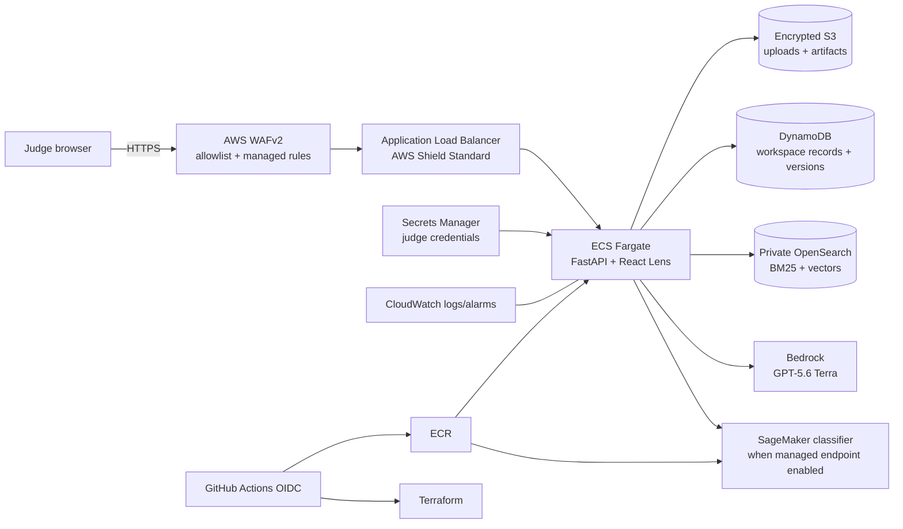

# Kana Legal

Kana Legal helps acquisition reviewers and mission analysts turn contract and
reference documents into cited findings, research drafts, and human-reviewed
records. The React **Lens** workspace connects document ingestion, trained
clause classification, source retrieval, and review decisions in one application.

| Use case | Workflow | Result |
| --- | --- | --- |
| Government contract review | Upload or paste a contract, add acquisition context, triage findings, inspect evidence | Prioritized findings and an attributable review decision |
| Grounded mission research | Ask a question against available sources and inspect statement citations | A cited answer, summary, or decision-memo draft for human review |
| Foundational data ingestion | Import documents or sync an approved connection, track source changes, review entities | Versioned source records and approved JSON handoffs |

This is an independent hackathon prototype for public or synthetic documents.
Reviewers remain responsible for decisions. Connector readiness and production
limits are described in [LENS_WORKSPACE.md](LENS_WORKSPACE.md).

**Start here:** [Setup and troubleshooting](docs/SETUP.md) ·
[Six-minute demo and rubric coverage](docs/JUDGING_REVIEW.md) ·
[Contributor guide](CONTRIBUTING.md) ·
[Export integration](docs/INTEROPERABILITY.md) ·
[Architecture](#architecture) · [GovCloud deployment](#govcloud-deployment)

## Quick start

The integrated application combines the React judge interface with this
repository's parsing, identity, ingestion, and model infrastructure.
Read [INTEGRATION_PLAN.md](INTEGRATION_PLAN.md) for decisions and progress.
See [LENS_WORKSPACE.md](LENS_WORKSPACE.md) for the connected revamp, AWS
persistence, and current demo boundaries.

The model workflow is document upload/paste → trained clause classifier →
Terra-guided search of ingested FAR/DFARS passages → Terra risk review →
citation/location validation → finding cards, clause inventory, and evidence graph.
Model mode reports an error if a required service fails; it does not silently
substitute the deterministic demo. Container startup verifies and loads the
packaged model and corpus before the task can become healthy. `GET /health`
does not make a billable Bedrock call.

```bash
git lfs install
git clone https://github.com/Kana-Systems/NDIA-DC-Hackathon-2026.git
cd NDIA-DC-Hackathon-2026
git lfs pull
bash scripts/setup-local.sh
MODEL_REVIEW_ENABLED=false BEDROCK_ENABLED=false bash scripts/run-local.sh
```

Install [Git LFS](https://git-lfs.com), Python 3.12, and Node.js 22.12+ first.
For an existing clone, pull the latest commit and run `git lfs pull` before
setup. The selected trained Legal-BERT weights and
corrected FAR/DFARS database are included through LFS (about 458 MiB combined).
No retraining or corpus rebuild is needed. Setup installs both application and
transformer dependencies; it does not start training. GitHub source ZIP downloads
may contain LFS pointers instead of the actual files, so prefer cloning with LFS.
See [SHARED_ARTIFACTS.md](SHARED_ARTIFACTS.md) for verification and limitations.

Open **http://127.0.0.1:8080/lens/**. Local password: `contract-demo`, unless
overridden using `WORKSPACE_PASSWORD`. The React workflow accepts pasted text and
PDF/DOCX uploads, collects acquisition metadata, and displays actual model
identifiers. It is the only interactive UI.
The current model review limit is 30,000 extracted characters per request; larger
documents require splitting. Upload parsing also enforces archive, page, and size
limits. On macOS the Linux address-space limit is unavailable; subprocess timeout
and explicit document bounds remain active.

The quick start explicitly selects the offline workflow, which needs no AWS
credentials. To use live review after configuring GovCloud access, run
`bash scripts/run-local.sh`. The run script enables live
**GPT-5.6 Terra through AWS Bedrock** by default and
uses the existing AWS credential chain. Inference is billable and sends supplied
document text and retrieved evidence to Bedrock. Use public or synthetic documents
for this prototype. To explicitly run the legacy offline engine, set both
`MODEL_REVIEW_ENABLED=false BEDROCK_ENABLED=false` when launching.

The following release artifacts are shared; other generated files stay ignored:

- `artifacts/knowledge/federal-v2.sqlite` (LFS): official source snapshots indexed for
  full-text retrieval, with commit versions, content hashes and reference links.
- `artifacts/models/legal-bert-cuad/`: completed trained weights (LFS), tokenizer,
  configuration, attribution, provenance and measured evaluation results.
  `artifacts/models/selected.json` selects this completed baseline; comparison
  metrics are also included. Experimental candidates/checkpoints are not shared.
- `ml/data/` remains excluded: downloaded CUAD and training/validation/test data.

Rebuild source data with official GSA FAR/DFARS clones under
`artifacts/sources/far` and `artifacts/sources/dfars`, then run
`python -m knowledge.build_local`. A catalog entry is not an ingested source.
This local corpus currently covers those GSA DITA snapshots; other sources in the
20-entry catalog remain research/ingestion candidates.

Model commands and licenses: [ml/README.md](ml/README.md),
[CUAD attribution](ml/CUAD_ATTRIBUTION.md), and
[pretrained-model attribution](ml/PRETRAINED_ATTRIBUTION.md).
Run `bash scripts/check-local.sh` for regression checks. A live synthetic review
is available via `.venv/bin/python scripts/verify-model-review.py`.

An explainable pre-review assistant for public or synthetic government contract
documents. It identifies likely clauses, applies deterministic acquisition
rules, retrieves supporting policy passages, and uses GPT-5.6 Terra in Amazon
Bedrock to draft structured, cited findings. It is decision support for a
qualified reviewer, not legal advice or an authority for FAR/DFARS applicability.

This is an independent hackathon prototype. References to challenge sponsors,
government organizations, products, or regulations identify the problem context
and do not imply endorsement, authorization, certification, or official status.
See the [security and data limitations](#security-and-data-limitations) and
[security policy](SECURITY.md) for the prototype's operating boundaries.

## Architecture



Terraform deploys into `us-gov-west-1` in the `aws-us-gov` partition:

- a two-AZ VPC with public ALB subnets and private ECS/OpenSearch subnets;
- one NAT gateway for private Fargate image pulls, AWS API access, and approved
  source retrieval. A single gateway is intentional for this cost-limited demo,
  but it is an availability dependency; production should use one per AZ or
  validated GovCloud VPC endpoints;
- ECS Fargate with an immutable ECR image digest, deployment rollback,
  Container Insights, and CPU target tracking;
- an HTTPS ALB using an issued ACM certificate for an externally managed DNS
  hostname, an explicit security-group CIDR allowlist, AWS Shield Standard,
  and a regional AWS WAFv2 Web ACL. WAF independently enforces the trusted
  CIDRs, rate-limits each source, and applies AWS managed common-exploit,
  known-bad-input, and IP-reputation rules. Blocked requests are retained in
  CloudWatch for 30 days with authorization and cookie headers redacted.
  Squarespace supplies the validation and application CNAME records. The ALB
  forwards `/`, `/lens`, `/lens/*`, `/api/*`, and `/health`;
  `/ui`, `/docs`, and `/openapi.json` remain unexposed. Lens obtains a
  short-lived bearer token after constant-time password verification;
- private, encrypted single-node OpenSearch 2.15 for demo-scale hybrid retrieval,
  using separate contract-policy and security-domain enterprise indexes;
- separate encrypted, private S3 buckets. Uploads expire after seven days;
  versioned artifact and J2 source-object noncurrent versions expire after 30
  days;
- a customer-managed J2 KMS key, encrypted SQS queue and dead-letter queue, and
  DynamoDB registries for documents, entities, and changes;
- a digest-pinned fixture-ingestion task and, when a Graph secret container is
  explicitly enabled, a scheduled sovereign Microsoft Graph delta task;
- generated judge credentials in Secrets Manager, least-privilege ECS task and
  execution roles, 30-day CloudWatch logs, and an ALB 5xx alarm.

Resource names and tags contain operational identifiers only. Contract text,
findings, document names, and excerpts must never be placed in AWS tags,
resource descriptions, log stream names, or other resource metadata.

## Joint Staff J2 intelligence expansion

Contract review remains the primary workflow. The same retrieval, authorization,
provenance, and citation boundary also supports two reusable mission workflows:

- **Retrieval-Augmented Generation Intelligence Service** - authenticated
  question answering, summaries, and analyst-review drafts over approved sources.
- **Automated Foundational Data Ingestion** - versioned connector ingestion,
  deterministic chunking, entity resolution, relationship mapping, change
  detection, provenance, and quality-control status.

Synthetic fixtures are evaluation-only: deployment no longer runs sample
knowledge or J2 fixture ingestion. Existing fixtures are not deleted, and the
new Lens workspace does not retrieve from them. The
Microsoft Graph connector implements delta pagination, sovereign-cloud endpoint
configuration, permission-to-ACL mapping, updates, and tombstones; it remains
disabled until an administrator enables its Terraform secret container and
supplies a least-privilege app registration in Secrets Manager.

Retrieval is deny-by-default. Indexed chunks carry `security_label` and
`acl_principals`; lexical and vector searches apply those filters, and the
application rechecks every result and citation before returning it. Local demo
tokens exercise user/group claims. Production deployments must switch to the
OIDC adapter and an approved identity provider.

Foundational entity matches are deterministic candidates, not intelligence
conclusions. Changes, relationships, summaries, and drafts must retain citations
or are marked unsupported. Analyst review remains required.

### J2 API examples

Obtain a 30-minute demo token (local/public synthetic demonstrations only):

```bash
TOKEN="$(
  curl --fail --silent \
    -F username=judge \
    -F password="$WORKSPACE_PASSWORD" \
    http://127.0.0.1:8080/api/v1/auth/demo-token |
  python -c 'import json,sys; print(json.load(sys.stdin)["access_token"])'
)"
```

Ask for a cited answer, summary, or draft:

```bash
curl --fail \
  -H "Authorization: Bearer $TOKEN" \
  -H "Content-Type: application/json" \
  -d '{"query":"Summarize foundational-data provenance requirements","mode":"summary"}' \
  http://127.0.0.1:8080/api/v1/intelligence/query
```

Entity, change, relationship, and decision operations are available below
`/api/v1/intelligence/`. API responses never authorize a citation merely because
a model emitted its ID.

### Security-domain deployment

`security_domain` namespaces the enterprise index, connector queue, registries,
change records, and encryption resources. Deploy each domain from a separate
AWS account and Terraform state key. The repository deploys only `demo`; it does
not create cross-domain links, replication, or accreditation. Public/synthetic
data restrictions remain in force.

## Prerequisites

- Python 3.12 and Docker for local use.
- Terraform 1.10+, AWS CLI v2, PowerShell 7, and GNU Make for deployment.
- An AWS GovCloud account with access to `us-gov-west-1`.
- Control of the external DNS hostname `ndia.kana.systems` in Squarespace and an
  issued ACM public certificate for that exact hostname in `us-gov-west-1`.
- A linked AWS commercial account. Accept the provider EULA and enable model
  access for `openai.gpt-5.6-terra` through the linked commercial account before
  deployment. See [Amazon Bedrock model access][bedrock-access] and verify the
  model is enabled in the GovCloud console; commercial-region enablement alone
  does not prove GovCloud runtime access.
- A GitHub environment named `govcloud-demo` configured with required reviewers.
  The only AWS-authenticated job is bound to this environment.
- A cost budget configured in the linked standard AWS account, where GovCloud
  billing information and AWS Budgets are managed.

[bedrock-access]: https://docs.aws.amazon.com/bedrock/latest/userguide/model-access.html

In GovCloud, OpenAI GPT-5.6 Terra uses SigV4-signed Responses API requests on
`bedrock-mantle.us-gov-west-1.api.aws`, not Bedrock Runtime Converse or
`InvokeModel`. The ECS task role grants only
`bedrock-mantle:CreateInference` on
`arn:aws-us-gov:bedrock-mantle:us-gov-west-1:ACCOUNT:project/*`. Titan Text
Embeddings V2 remains on `bedrock-runtime` and separately receives only
`bedrock:InvokeModel` on its foundation-model ARN.

## Local run

The [setup guide](docs/SETUP.md) is the supported path, including prerequisites,
offline/live modes, a working smoke check, updates, and troubleshooting. For a
manual offline launch after setup:

```bash
export WORKSPACE_USERNAME=judge
export WORKSPACE_PASSWORD='replace-with-a-local-secret'
export DEMO_JWT_SECRET='replace-with-a-separate-random-signing-secret'
export BEDROCK_ENABLED=false
export MODEL_REVIEW_ENABLED=false
.venv/bin/python -m uvicorn app.main:app --host 127.0.0.1 --port 8080
```

Open `http://127.0.0.1:8080/lens/`; `GET /health` is unauthenticated for health
checks. With Bedrock disabled, the deterministic local adapters support the
sample workflow without AWS credentials. To test Terra, use short-lived
GovCloud credentials, set `BEDROCK_ENABLED=true`,
`BEDROCK_MODEL_ID=openai.gpt-5.6-terra`, and `AWS_REGION=us-gov-west-1`.

The acquisition metadata checklist is agency, solicitation number, contract
type, estimated value/threshold, set-aside, commercial off-the-shelf
(COTS)/commercial-product status, performance period, place of performance, and
acquisition stage
(pre-solicitation, solicitation, evaluation, award, or post-award). These are
review inputs only; do not place their values in AWS resource metadata.

Container run:

```bash
git lfs pull
docker build -t contract-review:local .
docker run --rm -p 8080:8080 \
  -e WORKSPACE_USERNAME=judge \
  -e WORKSPACE_PASSWORD='replace-with-a-local-secret' \
  -e DEMO_JWT_SECRET='replace-with-a-separate-random-signing-secret' \
  -e BEDROCK_ENABLED=false \
  contract-review:local \
  uvicorn app.main:app --host 0.0.0.0 --port 8080 --no-access-log
```

Never commit `.env`, downloaded contracts, generated reports, model artifacts,
AWS credentials, or Terraform variable/state files.

## Programmatic API

The deployed ALB exposes `/api/*` because those routes apply the same generated
judge username/password with constant-time HTTP Basic verification. Health
checks remain intentionally unauthenticated; interactive UI requests remain
under `/lens/*`; generated OpenAPI and Swagger routes are not exposed.

```bash
curl --fail --user 'judge:RETRIEVED_SECRET' \
  -F 'file=@synthetic-contract.docx' \
  -F 'metadata_json={"agency":"Example","solicitation_number":"SYN-001","contract_type":"firm-fixed-price","estimated_value":250000,"commercial_product":true,"place_of_performance":"United States","acquisition_stage":"solicitation"}' \
  https://review.example.mil/api/v1/reviews
```

Use only public/synthetic content and avoid command history when supplying the
password. For automation, retrieve the secret with a short-lived authorized
GovCloud session and keep it out of logs.

## Knowledge ingestion

Download official source files out of band, record the source URL, effective
date, retrieval date, and checksum, then normalize them locally. The ingestion
tools do not fetch from the network:

```bash
python -m knowledge.ingest_dita INPUT OUTPUT.jsonl \
  --authority FAR --document-id FAR --document-title "Federal Acquisition Regulation"
python -m knowledge.ingest_smart_matrix MATRIX.csv matrix.jsonl
python -m knowledge.opensearch_bulk OUTPUT.jsonl bulk.ndjson \
  --mapping-output mapping.json --vector-dimensions 1024
```

Every successful main-branch Terraform apply launches a one-shot Fargate task
in the private subnets and seeds
`knowledge/samples/official_sources.jsonl` into
`government-contract-knowledge-v1` with Titan embeddings. The workflow waits
for the task to stop and fails before service stabilization or smoke testing if
the indexer container does not exit zero. Stable citation IDs make this
repeatable; the sample records are demo evidence, not a complete policy corpus.

To ingest full normalized sources, run the same packaged indexer from an
AWS-SigV4 identity inside the VPC (for example, a purpose-built one-shot ECS
task using an image that includes the normalized JSONL):

```bash
python -m knowledge.index_opensearch normalized/all-sources.jsonl \
  --endpoint "$OPENSEARCH_ENDPOINT" \
  --index government-contract-knowledge-v1 \
  --embed
```

Do not treat cached text as current: preserve provenance and re-ingest after
official FAR/DFARS revisions. The versioned YAML rules and playbook are
reviewer-maintained policy inputs, not legal determinations.

The deployed task sets `OPENSEARCH_ENABLED=true`,
`OPENSEARCH_INDEX=government-contract-knowledge-v1`,
`EMBEDDING_MODEL_ID=amazon.titan-embed-text-v2:0`, and
`EMBEDDING_DIMENSIONS=1024`. The current application settings consume the
equivalent `OPENSEARCH_VECTOR_ENABLED=true` and
`TITAN_EMBEDDING_MODEL_ID=amazon.titan-embed-text-v2:0` aliases; Terraform sets
both naming forms explicitly. It sets `HOME=/tmp/home` on a writable ephemeral
`/tmp` volume; the remainder of the container filesystem is read-only.

## ML training

CUAD trains a clause-identification model; it does not establish FAR or DFARS
applicability. Review `ml/CUAD_ATTRIBUTION.md`, supply the expected archive
digest, and explicitly accept the dataset license:

```bash
python -m ml.download_cuad --accept-license --sha256 EXPECTED_SHA256
python -m ml.preprocess_cuad ml/data/cuad.zip
python -m pip install -r ml/requirements-training.txt
python -m ml.train
```

Terraform provisions a dedicated KMS-encrypted training bucket, a scoped
SageMaker execution role, and an optional submitter policy. It does not start a
billable job. After deployment, an administrator may attach the submitter policy
to an approved developer role:

```bash
cd infra/terraform
TRAINING_BUCKET="$(terraform output -raw sagemaker_training_bucket_name)"
TRAINING_ROLE_ARN="$(terraform output -raw sagemaker_training_role_arn)"
SUBMITTER_POLICY_ARN="$(terraform output -raw sagemaker_submitter_policy_arn)"

aws iam attach-role-policy \
  --role-name APPROVED_DEVELOPER_ROLE \
  --policy-arn "$SUBMITTER_POLICY_ARN"
cd ../..
```

From the repository root, install the launcher, upload the processed public CUAD
files, and preview the resolved `ml.g6.xlarge` job:

```bash
python -m pip install -r ml/requirements-sagemaker.txt
export SAGEMAKER_TRAINING_BUCKET="$TRAINING_BUCKET"
export SAGEMAKER_ROLE_ARN="$TRAINING_ROLE_ARN"
./scripts/train-sagemaker.sh

# Explicitly starts billable GPU compute:
./scripts/train-sagemaker.sh --submit
```

The account currently has capacity quota for one `ml.g6.xlarge` training job.
The script rejects non-GovCloud credentials, validates required input files,
syncs them to `input/<model-family>`, and writes checkpoints and final artifacts
under matching model-family prefixes. Job creation is limited to the approved
instance types configured in Terraform and each supplied config has a maximum
runtime. To compare another encoder, set `MODEL_FAMILY` and
`SAGEMAKER_CONFIG`; see `ml/README.md` for the included RoBERTa example.
Monitor with `aws sagemaker list-training-jobs` and
`aws sagemaker describe-training-job`; stop an unwanted job with
`aws sagemaker stop-training-job`.

Record label metrics, source commit/digest, base model, parameters, and known
failure modes with each artifact.

The GovCloud image packages the reviewed Legal-BERT snapshot, tokenizer,
provenance, CPU inference dependencies, and versioned FAR/DFARS corpus from Git
LFS. ECS sets `MODEL_REVIEW_ENABLED=true` and loads those artifacts before the
task becomes healthy. Contract findings still combine learned clause candidates
with deterministic keyword coverage, governed rules, retrieved authority, and
Terra synthesis; classifier labels alone never establish applicability. Missing
or invalid artifacts fail deployment rather than silently selecting the
heuristic.

The optional Llama deployment uses the hash-verified three-seed
`Llama-3.1-8B-r128-lr075-cap30-d03` ensemble only as retrieval triage. Its
document-disjoint selection result was 78.55% micro-F1, 83.22% precision, and
74.38% recall; it did not meet the 80% recall promotion floor. Supplying the
SHA-256-addressed `CLASSIFIER_MODEL_DATA_URL` deployment secret makes Terraform
create one network-isolated `ml.g6e.2xlarge` SageMaker endpoint and makes ECS call
it through least-privilege IAM. The deployment builds a private, digest-pinned
inference image. The artifact remains KMS-encrypted in S3; G6e's fixed local
NVMe storage is hardware-encrypted with per-instance keys. The endpoint returns
classifier candidates to the existing retrieval and Terra prompts; those
candidates remain non-authoritative and are never treated as legal findings.

The reviewed object URI is recorded in
`ml/deployment/llama_r128_ensemble_artifact.json`. Set the secret to the exact
output of:

```bash
jq -r '.s3_uri' ml/deployment/llama_r128_ensemble_artifact.json
```

Deployment verifies the current S3 version, byte count, model ID, archive hash
metadata, and KMS encryption against that committed manifest before creating or
updating the endpoint.

Leaving `CLASSIFIER_MODEL_DATA_URL` empty creates no billable endpoint and keeps
the packaged Legal-BERT artifact active. Clearing the secret and redeploying is
the rollback path. A continuously running endpoint incurs hourly GPU charges.
For the judging ablation, compare `CLASSIFIER_ENABLED=false` (rules/RAG plus
keyword baseline) with `CLASSIFIER_ENABLED=true` (packaged classifier plus the
same rules/RAG), using the same synthetic inputs and recording the active model
provenance.

## ACM and Squarespace DNS

DNS for `ndia.kana.systems` remains in Squarespace. Request the certificate in
the same GovCloud account and region as the ALB:

```bash
aws acm request-certificate \
  --region us-gov-west-1 \
  --domain-name ndia.kana.systems \
  --validation-method DNS \
  --key-algorithm RSA_2048
```

Read the generated validation record:

```bash
aws acm describe-certificate \
  --region us-gov-west-1 \
  --certificate-arn ACM_CERTIFICATE_ARN \
  --output json
```

In Squarespace, open the `kana.systems` DNS settings and add the generated CNAME
under Custom Records. Squarespace appends the root domain automatically, so a
validation name such as `_token.ndia.kana.systems.` is entered as
`_token.ndia`. Enter the ACM validation value without its trailing period.
Retain this record permanently so ACM can renew the certificate.

Wait for issuance before deploying:

```bash
aws acm wait certificate-validated \
  --region us-gov-west-1 \
  --certificate-arn ACM_CERTIFICATE_ARN
```

Terraform selects the newest issued Amazon certificate matching
`ndia.kana.systems`. After deployment, read the workflow notice or Terraform
output `external_dns_cname_target`. Add the application record in Squarespace:

```text
Type: CNAME
Name: ndia
Data: <external_dns_cname_target, without a trailing period>
```

Do not remove unrelated Squarespace website or email records. After DNS
propagates, verify `https://ndia.kana.systems/health`.

Terraform also creates an AWS Resource Group named `ndia`. It includes all
taggable resources carrying the deployment's `Project` and `Environment` tags;
AWS-managed resources that do not support those tags are not included.

## GovCloud deployment

The bootstrap is deliberately out of Terraform because Terraform cannot safely
create its own remote state or initial GitHub trust. Run it once using an
administrator identity:

```bash
# Public repository, or a private repository visible to the current gh login:
gh api repos/OWNER/REPOSITORY \
  --jq '{owner_id: .owner.id, repository_id: .id}'

make bootstrap \
  GITHUB_REPO=OWNER/REPOSITORY \
  GITHUB_OWNER_ID=1234567 \
  GITHUB_REPOSITORY_ID=987654321
```

For a private repository, authenticate `gh` explicitly before the lookup
(`gh auth login`) or set `GH_TOKEN` to a fine-grained token with access to that
repository and read-only metadata. The token is used only by `gh api`; never
pass it to the bootstrap script or store it in Terraform/GitHub variables.
Owner and repository IDs are immutable identifiers and are not secrets.

The script validates the GovCloud partition and creates:

- a versioned, encrypted, public-blocked S3 state bucket with a TLS-only policy;
- the GitHub Actions OIDC provider; and
- a deployment role with no static access key. Its trust requires the exact
  immutable subject
  `repo:OWNER@OWNER_ID/REPOSITORY@REPOSITORY_ID:environment:govcloud-demo` and
  independently matches the `repository_owner_id`, `repository_id`,
  `environment=govcloud-demo`, and `ref=refs/heads/main` claims.

Both numeric IDs are mandatory. Bootstrap never falls back to mutable
`OWNER/REPOSITORY`-only trust.

### Public repository controls

After the repository owner authenticates to GitHub, enable these server-side
controls before accepting contributions:

- protect `main`: require a pull request, at least one approval, resolved
  conversations, passing test/CodeQL/action-pinning checks, and block force
  pushes and deletion;
- enable secret scanning, push protection, Dependabot alerts/security updates,
  private vulnerability reporting, and dependency-graph submission;
- configure `govcloud-demo` with required reviewers, prevent self-review, and
  restrict deployment to `main`;
- confirm the organization is authorized to publish the implementation and its
  included synthetic fixtures under Apache-2.0. Attribution files document
  externally sourced material but do not replace that owner approval.

Set the GitHub Actions secrets printed by the script. Repository secrets work;
placing them in the protected `govcloud-demo` environment is preferred:
`AWS_GOV_REGION`, `AWS_GOV_ROLE_ARN`, `TF_STATE_BUCKET`, `TF_STATE_KEY`,
`APP_DOMAIN`, and `ALLOWED_INGRESS_CIDRS_JSON` (for example,
`["192.0.2.10/32"]`). Terraform has
no default ingress range; supply only reviewed judge or VPN egress CIDRs.
Also set `SECURITY_DOMAIN=demo` and
`CREATE_GRAPH_CONNECTOR_SECRET=false`. Environment approval occurs before these
secrets are exposed to the deployment job; pull-request test jobs cannot access
them. Protect changes to `.github/workflows/` and `infra/` with branch review.

Rotating Wi-Fi or office egress addresses are kept outside Git in the
`/contract-review/demo/trusted-ingress-cidrs` SSM parameter as a JSON array of
IPv4 CIDRs no broader than `/27`. Prefer `/32`; use a bounded provider-owned
egress range only when repeated observations confirm address rotation.
Terraform merges that parameter with
`ALLOWED_INGRESS_CIDRS_JSON` for both the ALB security group and WAF IP set:

```bash
aws ssm put-parameter \
  --region us-gov-west-1 \
  --name /contract-review/demo/trusted-ingress-cidrs \
  --type String \
  --value '["203.0.113.10/32"]' \
  --overwrite
```

On every push to `main`, `.github/workflows/deploy.yml` runs tests without AWS
credentials, then enters the `govcloud-demo` environment gate (approval applies
when configured in GitHub). Only the
single environment-bound deploy job can request an OIDC token or assume the
Terraform role. The pipeline:

1. installs the bounded application/dev dependency files, runs Python
   lint/tests and the deterministic J2 intelligence benchmark, checks the
   environment, and validates Terraform;
2. authenticates to GovCloud with GitHub OIDC;
3. verifies the pinned classifier artifact and its base-image pull access when
   the managed endpoint is enabled, then ensures the ECR repository exists;
4. builds an amd64 image with SBOM/provenance and pushes it to immutable ECR
   under `COMMIT_SHA-RUN_ID-RUN_ATTEMPT`, so reruns never collide;
5. builds the private classifier image when enabled, resolves immutable image
   digests, runs a Terraform plan, and applies it;
6. verifies the managed classifier endpoint with a synthetic inference request;
7. leaves sample knowledge and synthetic J2 ingestion disabled; these fixtures
   are used in local tests and benchmarks;
8. forces ECS deployment, waits for service stability, and verifies that every
   registered ALB target is healthy. Public HTTPS is verified after the
   Squarespace application CNAME is created.

For `workflow_dispatch`, select the `main` branch in GitHub’s “Run workflow”
dialog. A manual run from any other branch or tag still executes the
credential-free validation job and reports its result, but the deploy job is
marked skipped by its `github.ref == 'refs/heads/main'` job condition. The
skipped job does not request `govcloud-demo` approval, receive an OIDC token, or
assume the GovCloud role.

When the managed classifier is enabled, deployment reconciles the
`classifier-base-image-pull` inline policy from
`scripts/iam/classifier-base-image-pull.json`, also installed by the GovCloud
bootstrap script. It permits only image pulls from the AWS-owned GovCloud
Hugging Face repository used by `Dockerfile.sagemaker`. The job checks access
to the pinned digest before building, allowing up to one minute for IAM
propagation. The existing project-role IAM permission covers this policy
update; no registry write access is granted.

The classifier runtime is reused by an immutable ECR tag derived from
`Dockerfile.sagemaker`, so UI/documentation updates do not rebuild its large
base image. Changing the Dockerfile builds a new runtime. The deployment
retention policy keeps the latest three classifier runtimes separately from
ordinary application images so frequent UI releases do not evict the runtime.
The deployment
contract test requires updating the cache design if build-context inputs are
introduced. Terraform separately grants the GitHub deployment role
`iam:PassRole` for the exact classifier execution role, with
`iam:PassedToService` restricted to `sagemaker.amazonaws.com`, before model
creation. CI derives `github_deploy_role_name` from its configured OIDC role ARN.
The same policy grants model/configuration/endpoint lifecycle and tagging
operations for this classifier's resource names, plus invocation of its endpoint
for the smoke check. It grants no training-job access or account-wide SageMaker
administration.
Before model creation, `scripts/prepare-sagemaker-image.py` selects the
Linux/amd64 runtime from the build's OCI index and publishes a Docker V2
manifest accepted by SageMaker. It verifies manifest hashes and retains the
exact config and gzip layer digests, without pulling or rebuilding the image.
The original OCI build, SBOM, and provenance remain in ECR.

For a local infrastructure review:

```bash
cp infra/terraform/terraform.tfvars.example infra/terraform/terraform.tfvars
export TF_STATE_BUCKET=contract-review-tfstate-ACCOUNT-us-gov-west-1
make tf-init
make tf-validate
make tf-plan
make tf-apply
```

Retrieve the generated judge password only through an authorized GovCloud
session:

```bash
aws secretsmanager get-secret-value \
  --region us-gov-west-1 \
  --secret-id contract-review-demo/judge-credentials \
  --query SecretString --output text
```

Do not store that value in GitHub variables, logs, chat, screenshots, or demo
documents.

## Judge demo script

1. Sign in and state the boundary: public/synthetic inputs and decision support,
   not a legal conclusion.
2. Open the bundled sample contract and enter its acquisition metadata.
3. Run review and show extraction, clause classification, deterministic
   applicability checks, policy retrieval, and Terra synthesis as separate
   stages.
4. Filter critical/high findings. Open one finding and trace its document
   location, classifier confidence, rule, exact authoritative citation, and
   recommended language.
5. Show a missing clause in the clause inventory and explain that rules decide
   applicability while the classifier only locates candidate language.
6. Compare deterministic rules/RAG with rules/RAG plus the classifier.
7. Export the structured report, then close by showing provenance timestamps,
   classifier provenance, unsupported-citation handling, and limitations.

## Security and data limitations

- This demo is not authorized for CUI, classified information, export-controlled
  data, source-selection information, PII, privileged material, or production
  contract records. Use public or synthetic documents only.
- TLS and encryption at rest reduce exposure but do not constitute an ATO,
  FedRAMP authorization, records schedule, legal hold process, DLP program, or
  incident-response capability.
- Shared Lens credentials are demo authentication, not user identity,
  authorization, audit attribution, MFA, or lifecycle management.
- Terraform deliberately has no default HTTPS ingress CIDR. Explicitly provide
  reviewed VPN or judge egress ranges; using `0.0.0.0/0` exposes the demo to the
  public internet and requires a deliberate risk decision.
- The single NAT gateway and single-node OpenSearch domain are deliberately
  non-HA. WAF, Shield Standard, rate limiting, and CIDR restrictions materially
  reduce exposure but do not make the service DDoS-proof. OpenSearch snapshots,
  restore testing, multi-AZ search, ALB access logging, private ingress, KMS
  customer-managed keys, Shield Advanced, and cross-region recovery are
  production follow-ups.
- The system can miss clauses, misclassify language, retrieve stale policy, or
  generate unsupported wording. Unresolvable citations must be rejected or
  removed at the report trust boundary; any finding left without resolvable
  evidence is treated as downgraded/unsupported rather than authoritative.
  Every recommendation requires qualified human review.
- The benchmark is a small, curated synthetic regression fixture for this
  prototype. A passing score demonstrates repeatability on those known cases;
  it is not independent validation, a legal-accuracy estimate, evidence of
  generalization to real solicitations, or a production acceptance threshold.
  CUAD primarily represents commercial contracts and does not validate FAR,
  DFARS, COTS applicability, agency supplements, or threshold determinations.
- S3 lifecycle expiration is asynchronous. If a user requests immediate
  deletion, explicitly delete the object and verify deletion rather than relying
  on the seven-day rule.

## CUAD attribution

The Contract Understanding Atticus Dataset (CUAD) was created by The Atticus
Project and is licensed under
[CC BY 4.0](https://creativecommons.org/licenses/by/4.0/). Project:
https://www.atticusprojectai.org/cuad. Source:
https://github.com/TheAtticusProject/cuad. Paper: Hendrycks et al., “CUAD: An
Expert-Annotated NLP Dataset for Legal Contract Review,” NeurIPS 2021.

No CUAD records are committed here. Derivative datasets and trained artifacts
must retain attribution, link the license, and identify modifications.

## Teardown

Export reports/model artifacts that must be retained, verify no legal or records
hold applies, then empty the protected S3/ECR resources. Terraform intentionally
uses `force_destroy = false` so accidental teardown cannot delete data:

```bash
aws s3 rm s3://UPLOADS_BUCKET --recursive
aws s3 rm s3://ARTIFACTS_BUCKET --recursive
aws s3 rm s3://J2_SOURCE_BUCKET --recursive
# Delete noncurrent artifact/source versions and ECR images after explicit review.
make tf-plan
make tf-destroy CONFIRM_DESTROY=contract-review
```

The state bucket and GitHub OIDC bootstrap resources are out of band. After all
environments are gone, delete the inline deployment policy/role, delete the OIDC
provider only if no other repository uses it, empty all state versions, and then
delete the state bucket. Disable Bedrock model access separately if it is no
longer required.
