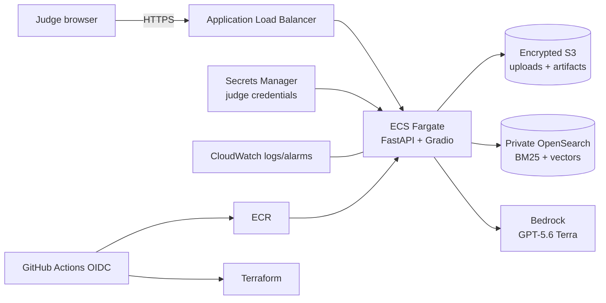

# Government Contract Review Demo

An explainable pre-review assistant for public or synthetic government contract
documents. It identifies likely clauses, applies deterministic acquisition
rules, retrieves supporting policy passages, and uses GPT-5.6 Terra in Amazon
Bedrock to draft structured, cited findings. It is decision support for a
qualified reviewer, not legal advice or an authority for FAR/DFARS applicability.

This is an independent hackathon prototype. References to challenge sponsors,
government organizations, products, or regulations identify the problem context
and do not imply endorsement, authorization, certification, or official status.
Repository owners should complete the
[public release checklist](RELEASE_CHECKLIST.md) before publication or
deployment.

## Architecture



Terraform deploys into `us-gov-west-1` in the `aws-us-gov` partition:

- a two-AZ VPC with public ALB subnets and private ECS/OpenSearch subnets;
- one NAT gateway for private Fargate image pulls, AWS API access, and approved
  source retrieval. A single gateway is intentional for this cost-limited demo,
  but it is an availability dependency; production should use one per AZ or
  validated GovCloud VPC endpoints;
- ECS Fargate with an immutable ECR image digest, deployment rollback,
  Container Insights, and CPU target tracking;
- an HTTPS ALB using an issued ACM certificate for an externally managed DNS
  hostname. Squarespace supplies the validation and application CNAME records.
  The ALB forwards `/`, `/ui`, `/ui/*`, `/api/*`, and
  `/health`; `/docs` and `/openapi.json` remain unexposed. Gradio enforces the
  shared judge credential under `/ui`, and the programmatic `/api/*` routes
  enforce constant-time HTTP Basic credential verification;
- private, encrypted single-node OpenSearch 2.15 for demo-scale hybrid retrieval,
  using separate contract-policy and security-domain enterprise indexes;
- separate encrypted, private S3 buckets. Uploads expire after seven days;
  versioned artifact and J2 source-object noncurrent versions expire after 30
  days;
- a customer-managed J2 KMS key, encrypted SQS queue and dead-letter queue, and
  DynamoDB registries for documents, entities, changes, and reviewed workflows;
- a digest-pinned fixture-ingestion task and, when a Graph secret container is
  explicitly enabled, a scheduled sovereign Microsoft Graph delta task;
- generated judge credentials in Secrets Manager, least-privilege ECS task and
  execution roles, 30-day CloudWatch logs, and an ALB 5xx alarm.

Resource names and tags contain operational identifiers only. Contract text,
findings, document names, and excerpts must never be placed in AWS tags,
resource descriptions, log stream names, or other resource metadata.

## Joint Staff J2 intelligence expansion

Contract review remains the primary workflow. The same retrieval, authorization,
provenance, and citation boundary also supports three reusable mission workflows:

- **Retrieval-Augmented Generation Intelligence Service** — authenticated
  question answering, summaries, and analyst-review drafts over approved sources.
- **Automated Foundational Data Ingestion** — versioned connector ingestion,
  deterministic chunking, entity resolution, relationship mapping, change
  detection, provenance, and quality-control status.
- **Target System Object Development** — cited field suggestions and
  relationships staged as draft objects. Only an analyst-approved object can
  reach the JSON export adapter, and that adapter performs no external write.

The deployed fixture worker automatically generates and ingests 120 synthetic
public/shared-drive documents into versioned S3 objects, DynamoDB manifests and
change events, and the ACL-bearing enterprise OpenSearch index. This is a real
end-to-end scale and ACL test, but it is not evidence that a Microsoft 365 tenant
has been integrated. The
Microsoft Graph connector implements delta pagination, sovereign-cloud endpoint
configuration, permission-to-ACL mapping, updates, and tombstones; it remains
disabled until an administrator enables its Terraform secret container and
supplies a least-privilege app registration in Secrets Manager.

Retrieval is deny-by-default. Indexed chunks carry `security_label` and
`acl_principals`; lexical and vector searches apply those filters, and the
application rechecks every result and citation before returning it. Local demo
tokens exercise user/group claims. Production deployments must switch to the
OIDC adapter and an approved identity provider.

Foundational entity matches are deterministic candidates, not intelligence
conclusions. Changes, generated fields, relationships, summaries, and drafts
must retain citations or are marked unsupported. Analyst approval is always
required before export.

### J2 API examples

Obtain a 30-minute demo token (local/public synthetic demonstrations only):

```bash
TOKEN="$(
  curl --fail --silent \
    -F username=judge \
    -F password="$GRADIO_PASSWORD" \
    http://127.0.0.1:8080/api/v1/auth/demo-token |
  python -c 'import json,sys; print(json.load(sys.stdin)["access_token"])'
)"
```

Ask for a cited answer, summary, or draft:

```bash
curl --fail \
  -H "Authorization: Bearer $TOKEN" \
  -H "Content-Type: application/json" \
  -d '{"query":"Summarize foundational-data provenance requirements","mode":"summary"}' \
  http://127.0.0.1:8080/api/v1/intelligence/query
```

Entity, change, relationship, target-object, decision, and approved JSON export
operations are available below `/api/v1/intelligence/`. API responses never
authorize a citation merely because a model emitted its ID.

### Security-domain deployment

`security_domain` namespaces the enterprise index, connector queue, registries,
workflow records, and encryption resources. Deploy each domain from a separate
AWS account and Terraform state key. The repository deploys only `demo`; it does
not create cross-domain links, replication, or accreditation. Public/synthetic
data restrictions remain in force.

## Prerequisites

- Python 3.12 and Docker for local use.
- Terraform 1.10+, AWS CLI v2, PowerShell 7, and GNU Make for deployment.
- An AWS GovCloud account with access to `us-gov-west-1`.
- Control of the external DNS hostname `ndia.kana.systems` in Squarespace and an
  issued ACM public certificate for that exact hostname in `us-gov-west-1`.
- A linked AWS commercial account. Accept the provider EULA and enable model
  access for `openai.gpt-5.6-terra` through the linked commercial account before
  deployment. See [Amazon Bedrock model access][bedrock-access] and verify the
  model is enabled in the GovCloud console; commercial-region enablement alone
  does not prove GovCloud runtime access.
- A GitHub environment named `govcloud-demo` configured with required reviewers.
  The only AWS-authenticated job is bound to this environment.
- A cost budget configured in the linked standard AWS account, where GovCloud
  billing information and AWS Budgets are managed.

[bedrock-access]: https://docs.aws.amazon.com/bedrock/latest/userguide/model-access.html

In GovCloud, OpenAI GPT-5.6 Terra uses SigV4-signed Responses API requests on
`bedrock-mantle.us-gov-west-1.api.aws`, not Bedrock Runtime Converse or
`InvokeModel`. The ECS task role grants only
`bedrock-mantle:CreateInference` on
`arn:aws-us-gov:bedrock-mantle:us-gov-west-1:ACCOUNT:project/*`. Titan Text
Embeddings V2 remains on `bedrock-runtime` and separately receives only
`bedrock:InvokeModel` on its foundation-model ARN.

## Local run

Create an isolated environment and install the project dependencies once the
application requirements are present:

```bash
python -m venv .venv
source .venv/bin/activate                 # Windows PowerShell: .venv\Scripts\Activate.ps1
python -m pip install -r requirements.txt
# Optionally copy .env.example to .env and replace every placeholder.
export GRADIO_USERNAME=judge
export GRADIO_PASSWORD='replace-with-a-local-secret'
export DEMO_JWT_SECRET='replace-with-a-separate-random-signing-secret'
export BEDROCK_ENABLED=false
uvicorn app.main:app --host 127.0.0.1 --port 8080
```

Open `http://127.0.0.1:8080/ui/`; `GET /health` is unauthenticated for health
checks. With Bedrock disabled, the deterministic local adapters support the
sample workflow without AWS credentials. To test Terra, use short-lived
GovCloud credentials, set `BEDROCK_ENABLED=true`,
`BEDROCK_MODEL_ID=openai.gpt-5.6-terra`, and `AWS_REGION=us-gov-west-1`.

The acquisition metadata checklist is agency, solicitation number, contract
type, estimated value/threshold, set-aside, commercial off-the-shelf
(COTS)/commercial-product status, performance period, place of performance, and
acquisition stage
(pre-solicitation, solicitation, evaluation, award, or post-award). These are
review inputs only; do not place their values in AWS resource metadata.

Container run:

```bash
docker build -t contract-review:local .
docker run --rm -p 8080:8080 \
  -e GRADIO_USERNAME=judge \
  -e GRADIO_PASSWORD='replace-with-a-local-secret' \
  -e DEMO_JWT_SECRET='replace-with-a-separate-random-signing-secret' \
  -e BEDROCK_ENABLED=false \
  contract-review:local \
  uvicorn app.main:app --host 0.0.0.0 --port 8080 --no-access-log
```

Never commit `.env`, downloaded contracts, generated reports, model artifacts,
AWS credentials, or Terraform variable/state files.

## Programmatic API

The deployed ALB exposes `/api/*` because those routes apply the same generated
judge username/password with constant-time HTTP Basic verification. Health
checks remain intentionally unauthenticated; interactive UI requests remain
under `/ui/*`; generated OpenAPI and Swagger routes are not exposed.

```bash
curl --fail --user 'judge:RETRIEVED_SECRET' \
  -F 'file=@synthetic-contract.docx' \
  -F 'metadata_json={"agency":"Example","solicitation_number":"SYN-001","contract_type":"firm-fixed-price","estimated_value":250000,"commercial_product":true,"place_of_performance":"United States","acquisition_stage":"solicitation"}' \
  https://review.example.mil/api/v1/reviews
```

Use only public/synthetic content and avoid command history when supplying the
password. For automation, retrieve the secret with a short-lived authorized
GovCloud session and keep it out of logs.

## Knowledge ingestion

Download official source files out of band, record the source URL, effective
date, retrieval date, and checksum, then normalize them locally. The ingestion
tools do not fetch from the network:

```bash
python -m knowledge.ingest_dita INPUT OUTPUT.jsonl \
  --authority FAR --document-id FAR --document-title "Federal Acquisition Regulation"
python -m knowledge.ingest_smart_matrix MATRIX.csv matrix.jsonl
python -m knowledge.opensearch_bulk OUTPUT.jsonl bulk.ndjson \
  --mapping-output mapping.json --vector-dimensions 1024
```

Every successful main-branch Terraform apply launches a one-shot Fargate task
in the private subnets and seeds
`knowledge/samples/official_sources.jsonl` into
`government-contract-knowledge-v1` with Titan embeddings. The workflow waits
for the task to stop and fails before service stabilization or smoke testing if
the indexer container does not exit zero. Stable citation IDs make this
repeatable; the sample records are demo evidence, not a complete policy corpus.

To ingest full normalized sources, run the same packaged indexer from an
AWS-SigV4 identity inside the VPC (for example, a purpose-built one-shot ECS
task using an image that includes the normalized JSONL):

```bash
python -m knowledge.index_opensearch normalized/all-sources.jsonl \
  --endpoint "$OPENSEARCH_ENDPOINT" \
  --index government-contract-knowledge-v1 \
  --embed
```

Do not treat cached text as current: preserve provenance and re-ingest after
official FAR/DFARS revisions. The versioned YAML rules and playbook are
reviewer-maintained policy inputs, not legal determinations.

The deployed task sets `OPENSEARCH_ENABLED=true`,
`OPENSEARCH_INDEX=government-contract-knowledge-v1`,
`EMBEDDING_MODEL_ID=amazon.titan-embed-text-v2:0`, and
`EMBEDDING_DIMENSIONS=1024`. The current application settings consume the
equivalent `OPENSEARCH_VECTOR_ENABLED=true` and
`TITAN_EMBEDDING_MODEL_ID=amazon.titan-embed-text-v2:0` aliases; Terraform sets
both naming forms explicitly. It also sets `GRADIO_TEMP_DIR=/tmp/gradio` and
`HOME=/tmp/home` on a writable ephemeral `/tmp` volume; the remainder of the
container filesystem is read-only.

## ML training

CUAD trains a clause-identification model; it does not establish FAR or DFARS
applicability. Review `ml/CUAD_ATTRIBUTION.md`, supply the expected archive
digest, and explicitly accept the dataset license:

```bash
python -m ml.download_cuad --accept-license --sha256 EXPECTED_SHA256
python -m ml.preprocess_cuad ml/data/cuad.zip
python -m pip install -r ml/requirements-training.txt
python -m ml.train
```

For a one-off SageMaker job, upload the processed files to the Terraform
artifact bucket, configure the training role, and preview before submitting:

```bash
python -m pip install -r ml/requirements-sagemaker.txt
python -m ml.launch_sagemaker \
  --role-arn arn:aws-us-gov:iam::ACCOUNT:role/ROLE \
  --training-s3-uri s3://ARTIFACT_BUCKET/cuad/processed/
# Repeat with --submit only after reviewing the generated job.
```

Record label metrics, source commit/digest, base model, parameters, and known
failure modes with each artifact.

ECS sets `CLASSIFIER_ENABLED=true` and
`CLASSIFIER_MODEL_DIR=/srv/app/ml/model`. The packaged adapter always combines
classifier output with transparent keyword coverage. The standard image uses
the deterministic heuristic fallback when no trained Hugging Face artifact is
included at `CLASSIFIER_MODEL_DIR`, or when loading/inference fails. A trained
image must include the model/tokenizer files and provenance manifest at that
path. Record the CUAD digest, training code revision, base model, label map,
threshold, and evaluation metrics with the artifact and surface that provenance
in demo reports.

Terraform intentionally does not provision a continuously running SageMaker
endpoint. SageMaker is used only for an explicitly submitted, one-off training
job; low-volume demo inference loads the packaged artifact inside Fargate.
For the judging ablation, compare `CLASSIFIER_ENABLED=false` (rules/RAG plus
keyword baseline) with `CLASSIFIER_ENABLED=true` (packaged classifier plus the
same rules/RAG), using the same synthetic inputs and recording the active model
provenance.

## ACM and Squarespace DNS

DNS for `ndia.kana.systems` remains in Squarespace. Request the certificate in
the same GovCloud account and region as the ALB:

```bash
aws acm request-certificate \
  --region us-gov-west-1 \
  --domain-name ndia.kana.systems \
  --validation-method DNS \
  --key-algorithm RSA_2048
```

Read the generated validation record:

```bash
aws acm describe-certificate \
  --region us-gov-west-1 \
  --certificate-arn ACM_CERTIFICATE_ARN \
  --output json
```

In Squarespace, open the `kana.systems` DNS settings and add the generated CNAME
under Custom Records. Squarespace appends the root domain automatically, so a
validation name such as `_token.ndia.kana.systems.` is entered as
`_token.ndia`. Enter the ACM validation value without its trailing period.
Retain this record permanently so ACM can renew the certificate.

Wait for issuance before deploying:

```bash
aws acm wait certificate-validated \
  --region us-gov-west-1 \
  --certificate-arn ACM_CERTIFICATE_ARN
```

Terraform selects the newest issued Amazon certificate matching
`ndia.kana.systems`. After deployment, read the workflow notice or Terraform
output `external_dns_cname_target`. Add the application record in Squarespace:

```text
Type: CNAME
Name: ndia
Data: <external_dns_cname_target, without a trailing period>
```

Do not remove unrelated Squarespace website or email records. After DNS
propagates, verify `https://ndia.kana.systems/health`.

## GovCloud deployment

The bootstrap is deliberately out of Terraform because Terraform cannot safely
create its own remote state or initial GitHub trust. Run it once using an
administrator identity:

```bash
# Public repository, or a private repository visible to the current gh login:
gh api repos/OWNER/REPOSITORY \
  --jq '{owner_id: .owner.id, repository_id: .id}'

make bootstrap \
  GITHUB_REPO=OWNER/REPOSITORY \
  GITHUB_OWNER_ID=1234567 \
  GITHUB_REPOSITORY_ID=987654321
```

For a private repository, authenticate `gh` explicitly before the lookup
(`gh auth login`) or set `GH_TOKEN` to a fine-grained token with access to that
repository and read-only metadata. The token is used only by `gh api`; never
pass it to the bootstrap script or store it in Terraform/GitHub variables.
Owner and repository IDs are immutable identifiers and are not secrets.

The script validates the GovCloud partition and creates:

- a versioned, encrypted, public-blocked S3 state bucket with a TLS-only policy;
- the GitHub Actions OIDC provider; and
- a deployment role with no static access key. Its trust requires the exact
  immutable subject
  `repo:OWNER@OWNER_ID/REPOSITORY@REPOSITORY_ID:environment:govcloud-demo` and
  independently matches the `repository_owner_id`, `repository_id`,
  `environment=govcloud-demo`, and `ref=refs/heads/main` claims.

Both numeric IDs are mandatory. Bootstrap never falls back to mutable
`OWNER/REPOSITORY`-only trust.

### Public repository controls

After the repository owner authenticates to GitHub, enable these server-side
controls before accepting contributions:

- protect `main`: require a pull request, at least one approval, resolved
  conversations, passing test/CodeQL/action-pinning checks, and block force
  pushes and deletion;
- enable secret scanning, push protection, Dependabot alerts/security updates,
  private vulnerability reporting, and dependency-graph submission;
- configure `govcloud-demo` with required reviewers, prevent self-review, and
  restrict deployment to `main`;
- confirm the organization is authorized to publish the implementation and its
  included synthetic fixtures under Apache-2.0. Attribution files document
  externally sourced material but do not replace that owner approval.

Set the GitHub Actions secrets printed by the script. Repository secrets work;
placing them in the protected `govcloud-demo` environment is preferred:
`AWS_GOV_REGION`, `AWS_GOV_ROLE_ARN`, `TF_STATE_BUCKET`, `TF_STATE_KEY`,
`APP_DOMAIN`, and `ALLOWED_INGRESS_CIDRS_JSON` (for example,
`["192.0.2.10/32"]`). Terraform has
no default ingress range; supply only reviewed judge or VPN egress CIDRs.
Also set `SECURITY_DOMAIN=demo` and
`CREATE_GRAPH_CONNECTOR_SECRET=false`. Environment approval occurs before these
secrets are exposed to the deployment job; pull-request test jobs cannot access
them. Protect changes to `.github/workflows/` and `infra/` with branch review.

On every push to `main`, `.github/workflows/deploy.yml` runs tests without AWS
credentials, then waits for `govcloud-demo` environment approval. Only the
single environment-bound deploy job can request an OIDC token or assume the
Terraform role. After approval it:

1. installs the bounded application/dev dependency files, runs Python
   lint/tests and the deterministic J2 intelligence benchmark, checks the
   environment, and validates Terraform;
2. authenticates to GovCloud with GitHub OIDC;
3. creates the Terraform-managed ECR repository on the first run;
4. builds an amd64 image with SBOM/provenance and pushes it to immutable ECR
   under `COMMIT_SHA-RUN_ID-RUN_ATTEMPT`, so reruns never collide;
5. resolves the digest, runs a Terraform plan, and applies that exact image;
6. runs the exact-digest one-shot Fargate task in the private application
   network to seed sample OpenSearch knowledge and verifies its container exit;
7. runs a second exact-digest task that durably ingests and verifies at least 120
   synthetic documents in the J2 data plane;
8. forces ECS deployment, waits for service stability, and verifies that every
   registered ALB target is healthy. Public HTTPS is verified after the
   Squarespace application CNAME is created.

For `workflow_dispatch`, select the `main` branch in GitHub’s “Run workflow”
dialog. A manual run from any other branch or tag still executes the
credential-free validation job and reports its result, but the deploy job is
marked skipped by its `github.ref == 'refs/heads/main'` job condition. The
skipped job does not request `govcloud-demo` approval, receive an OIDC token, or
assume the GovCloud role.

For a local infrastructure review:

```bash
cp infra/terraform/terraform.tfvars.example infra/terraform/terraform.tfvars
export TF_STATE_BUCKET=contract-review-tfstate-ACCOUNT-us-gov-west-1
make tf-init
make tf-validate
make tf-plan
make tf-apply
```

Retrieve the generated judge password only through an authorized GovCloud
session:

```bash
aws secretsmanager get-secret-value \
  --region us-gov-west-1 \
  --secret-id contract-review-demo/judge-credentials \
  --query SecretString --output text
```

Do not store that value in GitHub variables, logs, chat, screenshots, or demo
documents.

## Judge demo script

1. Sign in and state the boundary: public/synthetic inputs and decision support,
   not a legal conclusion.
2. Open the bundled sample contract and enter its acquisition metadata.
3. Run review and show extraction, clause classification, deterministic
   applicability checks, policy retrieval, and Terra synthesis as separate
   stages.
4. Filter critical/high findings. Open one finding and trace its document
   location, classifier confidence, rule, exact authoritative citation, and
   recommended language.
5. Show a missing clause in the clause inventory and explain that rules decide
   applicability while the classifier only locates candidate language.
6. Compare deterministic rules/RAG with rules/RAG plus the classifier.
7. Export the structured report, then close by showing provenance timestamps,
   classifier provenance, unsupported-citation handling, and limitations.

## Security and data limitations

- This demo is not authorized for CUI, classified information, export-controlled
  data, source-selection information, PII, privileged material, or production
  contract records. Use public or synthetic documents only.
- TLS and encryption at rest reduce exposure but do not constitute an ATO,
  FedRAMP authorization, records schedule, legal hold process, DLP program, or
  incident-response capability.
- Gradio shared credentials are demo authentication, not user identity,
  authorization, audit attribution, MFA, or lifecycle management.
- Terraform deliberately has no default HTTPS ingress CIDR. Explicitly provide
  reviewed VPN or judge egress ranges; using `0.0.0.0/0` exposes the demo to the
  public internet and requires a deliberate risk decision.
- The single NAT gateway and single-node OpenSearch domain are deliberately
  non-HA. OpenSearch snapshots, restore testing, multi-AZ search, WAF, access
  logging, private ingress, KMS customer-managed keys, and cross-region recovery
  are production follow-ups.
- The system can miss clauses, misclassify language, retrieve stale policy, or
  generate unsupported wording. Unresolvable citations must be rejected or
  removed at the report trust boundary; any finding left without resolvable
  evidence is treated as downgraded/unsupported rather than authoritative.
  Every recommendation requires qualified human review.
- The benchmark is a small, curated synthetic regression fixture for this
  prototype. A passing score demonstrates repeatability on those known cases;
  it is not independent validation, a legal-accuracy estimate, evidence of
  generalization to real solicitations, or a production acceptance threshold.
  CUAD primarily represents commercial contracts and does not validate FAR,
  DFARS, COTS applicability, agency supplements, or threshold determinations.
- S3 lifecycle expiration is asynchronous. If a user requests immediate
  deletion, explicitly delete the object and verify deletion rather than relying
  on the seven-day rule.

## CUAD attribution

The Contract Understanding Atticus Dataset (CUAD) was created by The Atticus
Project and is licensed under
[CC BY 4.0](https://creativecommons.org/licenses/by/4.0/). Project:
https://www.atticusprojectai.org/cuad. Source:
https://github.com/TheAtticusProject/cuad. Paper: Hendrycks et al., “CUAD: An
Expert-Annotated NLP Dataset for Legal Contract Review,” NeurIPS 2021.

No CUAD records are committed here. Derivative datasets and trained artifacts
must retain attribution, link the license, and identify modifications.

## Teardown

Export reports/model artifacts that must be retained, verify no legal or records
hold applies, then empty the protected S3/ECR resources. Terraform intentionally
uses `force_destroy = false` so accidental teardown cannot delete data:

```bash
aws s3 rm s3://UPLOADS_BUCKET --recursive
aws s3 rm s3://ARTIFACTS_BUCKET --recursive
aws s3 rm s3://J2_SOURCE_BUCKET --recursive
# Delete noncurrent artifact/source versions and ECR images after explicit review.
make tf-plan
make tf-destroy CONFIRM_DESTROY=contract-review
```

The state bucket and GitHub OIDC bootstrap resources are out of band. After all
environments are gone, delete the inline deployment policy/role, delete the OIDC
provider only if no other repository uses it, empty all state versions, and then
delete the state bucket. Disable Bedrock model access separately if it is no
longer required.